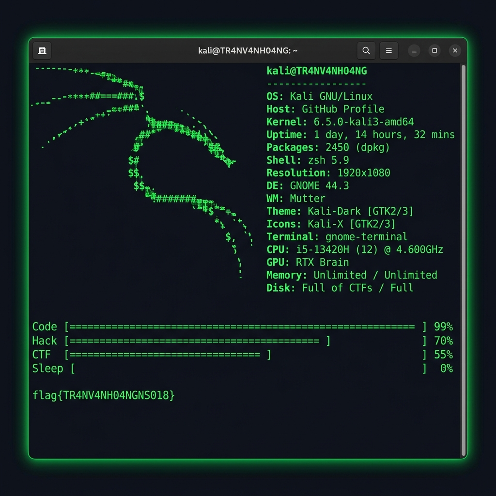

<div align="center">



<br/>


<br/>

[](https://github.com/Tr4nV4nH04ngNS018)
[](mailto:hkoioang22647@gmail.com)
[](#)

</div>

---

<h3 align="center">💀 <code>[0x01]</code> // SYSTEM PROFILE</h3>

```
┌──(root㉿kali)-[~/TR4NV4NH04NGNS018]
└─# cat /etc/system_profile
╔══════════════════════════════════════════════════════════════════╗
║  [*] CODENAME    : TR4NV4NH04NGNS018                           ║
║  [*] REAL NAME   : Tran Van Hoang                              ║
║  [*] BASE        : VKU — Da Nang, Vietnam                      ║
║  [*] ROLE        : Software Engineer / Security Enthusiast     ║
║  [*] STATUS      : ██████████████████████████ ACTIVE           ║
║  [*] THREAT LVL  : ███████████████░░░░░░░░░░ HIGH              ║
╚══════════════════════════════════════════════════════════════════╝
```

---

<h3 align="center">☠️ <code>[0x02]</code> // THREAT PROFILE</h3>

```python
#!/usr/bin/env python3
class Hacker:
    def __init__(self):
        self.name       = "Tran Van Hoang"
        self.alias      = "Tr4nV4nH04ngNS018"
        self.education  = "Software Engineering @ VKU"
        self.languages  = ["Vietnamese", "English"]
        self.interests  = ["Web Exploitation", "3D WebGL", "CTF", "Reverse Engineering"]

    def current_mission(self):
        return "Defending Capstone Project: EcoImpact Hero 🌍"

    def motto(self):
        return "Small habits, Big impacts. Hack the planet, save the Earth."

me = Hacker()
```

---

<h3 align="center">⚙️ <code>[0x03]</code> // ARSENAL & WEAPONRY</h3>

<p align="center">
  <a href="https://skillicons.dev">
    <br/>
    <br/>
    
  </a>
</p>

```
┌──(root㉿kali)-[~/arsenal]
└─# nmap -sV localhost

PORT      STATE    SERVICE         VERSION
───────── ──────── ─────────────── ──────────────────────────────
22/tcp    open     frontend        HTML5 / CSS3 / JS(ES6+) / TailwindCSS
80/tcp    open     3d-engine       Three.js (WebGL) + Blender glTF Pipeline
443/tcp   open     backend         Node.js / Express / REST APIs
3306/tcp  open     database        MySQL / MongoDB / LocalStorage
8080/tcp  open     proxy           PowerShell CORS Reverse Proxy
9999/tcp  open     ctf-solver      Reverse Engineering / Binary Exploit
```

---

<h3 align="center">📊 <code>[0x04]</code> // SYSTEM METRICS</h3>

<p align="center">
  
</p>

<p align="center">
  
  
</p>

<p align="center">
  
</p>

---

<h3 align="center">📂 <code>[0x05]</code> // EXPLOITS & REPOSITORIES</h3>

<table align="center">
<tr>
<td width="50%">

**🌍 [EcoImpact Hero](https://github.com/Tr4nV4nH04ngNS018/bwd)**
```
TYPE   : 3D Interactive Web App
STACK  : HTML/CSS/JS + Three.js + WebGL
FEAT   : Live Climate APIs, Carbon Calculator
         PowerShell CORS Proxy, Chart.js
STATUS : ██████████ DEPLOYED
```

</td>
<td width="50%">

**🏴 [write-up-CTF](https://github.com/Tr4nV4nH04ngNS018/write-up-CTF)**
```
TYPE   : Security Challenge Logs
STACK  : Binary / Web / Crypto / Forensics
FEAT   : Solved CTF write-ups and PoCs
STATUS : █████░░░░░ IN PROGRESS
```

</td>
</tr>
<tr>
<td width="50%">

**📊 [KPI-](https://github.com/Tr4nV4nH04ngNS018/KPI-)**
```
TYPE   : Performance Tracker
STACK  : TypeScript
FEAT   : Project KPI monitoring system
STATUS : ██████████ COMPLETE
```

</td>
<td width="50%">

**🛡️ [cyberbully](https://github.com/Tr4nV4nH04ngNS018/cyberbully)**
```
TYPE   : Cybersecurity Project
STACK  : HTML / Research
FEAT   : Anti-cyberbullying awareness
STATUS : ████████░░ ACTIVE
```

</td>
</tr>
</table>

---

<div align="center">

```
┌──(root㉿kali)-[~/contact]
└─# cat channels.conf

  ╔═══════════════════════════════════════════════════╗
  ║  📧 EMAIL   : hkoioang22647@gmail.com            ║
  ║  🐙 GITHUB  : github.com/Tr4nV4nH04ngNS018      ║
  ║  📍 LOCATE  : Da Nang, Vietnam                   ║
  ╚═══════════════════════════════════════════════════╝
```

<br/>

```
[ACCESS GRANTED] // session_active — hack_the_planet.sh
```


</div>


